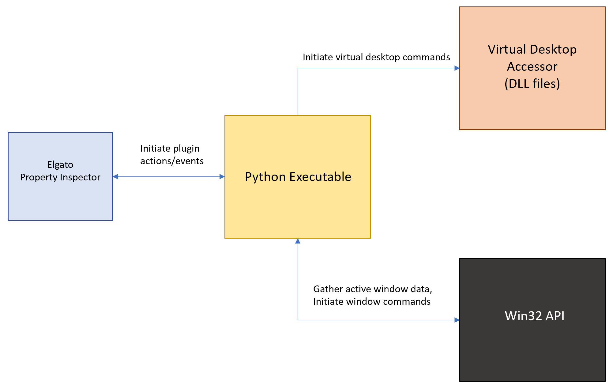

# Window Actions Elgato Plugin

This plugin allows a user to minimize, maximize or close any active window, with a tap of a button or through a multi-action sequence, while using an [Elgato Stream Deck](https://www.elgato.com/en/stream-deck)

# Quickstart

Download the following [setup file](https://drive.google.com/file/d/1mroVV7V2V3_2YWg8qMXGMe77FMA3N7Vk/view?usp=sharing)

### Pre-requisites

- StreamDeck 4.1 + 
- Windows 10+

# Description

The Elgato Stream Deck natively supports a [open system action](https://help.elgato.com/hc/en-us/articles/360028234471-Elgato-Stream-Deck-System-Actions-Hotkey-Open-Website-Multimedia-#h_01G93K00TJB5BHV93JTTJ0YV80), which can be used to open any application you need. However, it lacks the ability to minimize, close, or maximize the windows that this action creates. When setting up a multi-action workflow, streaming, or recording, these actions almost essential to have, since multiple applications need to be hidden or focused in. 

This app allows users to use an Elgato Stream Deck to minimize, maximize, and close windows on a Windows 10+ machine. 

# Alternative Workaround

On a Windows 10+ machine, a workaround to perform these window actions (minimize, maximize, and close), would be to download [`nircmd`](https://www.nirsoft.net/utils/nircmd.html), and create a `.bat` file, that when opened, runs a series of commands to perform such actions. However, this comes with the following problems:

1. It's tedious to configure a different `.bat` file for every window action needed
2. This requires learning the Windows OS CLI (Command Prompt or Powershell).
3. It's difficult to change the workflow in the future, as it requires manually updating a new [window identifier](#window-identifiers) in the `.bat` file directly. This may be necessary if an application updates itself and it's identifiers change, or if an action was configured for a one-time use case using `hwid`.

To amend these problems, this app/plugin was developed

# How This Plugin Works
### General Architecture

### Initiating Window Action Commands

Similar to our [workaround](#alternative-workaround), this app uses `nircmd` in the background, to initiate window actions. We can initiate these commands using a plugin built with `Node.js`, and re-packaging the nircmd.exe with the app. 

### Integrating a Node App

We integrate our Node app with the [Elgato Stream Deck Architecture](https://developer.elgato.com/documentation/stream-deck/sdk/plugin-architecture/) by converting the Node app into a `.exe` file, using [`nexe`](https://github.com/nexe/nexe). This `.exe` file becomes the entry point/Code path that our `manifest.json` points to for the plugin.

### Configuring the Property Inspector
This is where most of the magic happens. Using Elgato's Property Inspector, we can create a simple and initutive HTML form, that accepts the required [windowIdentifier](#window-identifiers), and passes it into our plugin, to execute. The quickest way to set this up, is by using pre-populated dropdowns, that can be selected. This prevents typos, and incorrect mappings,  which commonly occur when writing directly to `.bat` files.

As an added bonus, it also means users don't need to write any code to configure their actions.

### Populating Active Window Dropdown
To automatically populate a dropdown list of active/opened windows, we use python's powerful [`win32gui`](https://pypi.org/project/win32gui/#description) package. This allows us to interface with the [Windows Win32 Api](https://learn.microsoft.com/en-us/windows/win32/api/)(written in C++), and attain all the necessary data in `JSON` file. This is then passed to the [property inspector](#configuring-the-property-inspector), for selection.

### Optional Manual Identifier Input
If the automated dropdown list of active/opened windows is not enough, or a user wants to define the identifier manually, they are allowed to do so, by simply toggling the custom option. [`Gui Prop View.exe`](https://www.nirsoft.net/utils/gui_prop_view.html) is re-packaged into the plugin as well, to aid in defining the identifier manually.

# Window Identifiers

The following are the valid identifier types that can be configured.

- program name/process (.exe file name)
- [window handle](https://learn.microsoft.com/en-us/windows/apps/develop/ui-input/retrieve-hwnd) (`hwnd`)
- [window class name](https://learn.microsoft.com/en-us/windows/win32/winmsg/about-window-classes).
